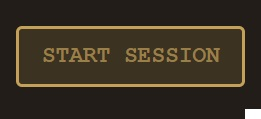
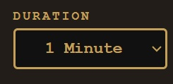
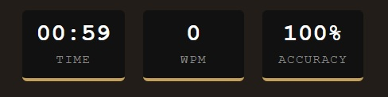
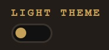
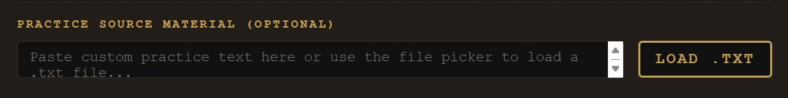

# Typewriter

A lightweight, customizable typing practice tool designed to help you improve speed and accuracy in a distraction-free environment.

---
👉 **[Click Here to Play the Live Demo](https://abyshergill.github.io/typewriter/)** 

## 🚀 Features
- **Start Session**: Begin a timed typing practice session instantly.


- **Session Duration**: Configure practice length (default: 1 minute).
  

- **Live Metrics**: Track Words Per Minute (WPM) and Accuracy in real time.
  

- **Themes**: Switch between light and dark modes for comfort.
  

- **Custom Practice Material**:
  - Paste your own text directly.
  - Load `.txt` files via the file picker.
  

---

## 🎹 Keyboard Layout
The app provides a visual reference of the standard QWERTY keyboard to guide practice:
```
Q W E R T Y U I O P
A S D F G H J K L ; '
Z X C V B N M , . /
```

---

## 📂 Usage
1. Click **Start Session** to begin.
2. Select **Duration** and **Theme** as preferred.
3. Paste or load custom text for practice (optional).
4. Type along and monitor your WPM and Accuracy metrics.

---

## 🛠️ Tech Notes
- Built for flexibility and quick setup.
- Supports external text files for personalized training.
- Minimalist design to keep focus on typing.

---

## 📜 License
This project is open-source (MIT). Feel free to fork, modify, and contribute.
